# hello_world

A new Flutter project.

## Getting Started
### Praktikum 1 - Membuat Project Flutter Baru
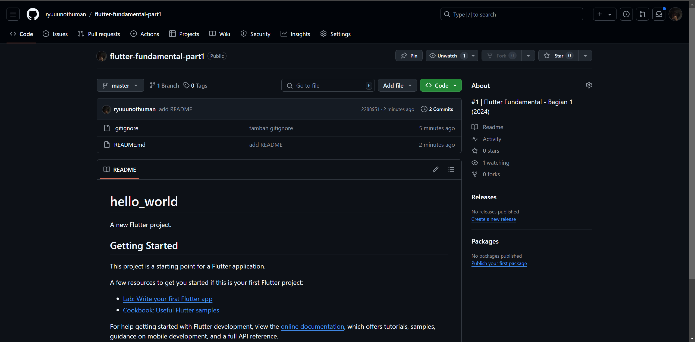
### Praktikum 2 - Menghubungkan Emu
(Kebetulan saya sudah setting android sdk sebelumnya, jadi tinggal pilih mau windows atau andro di sebelah pojok kanan bawah)\
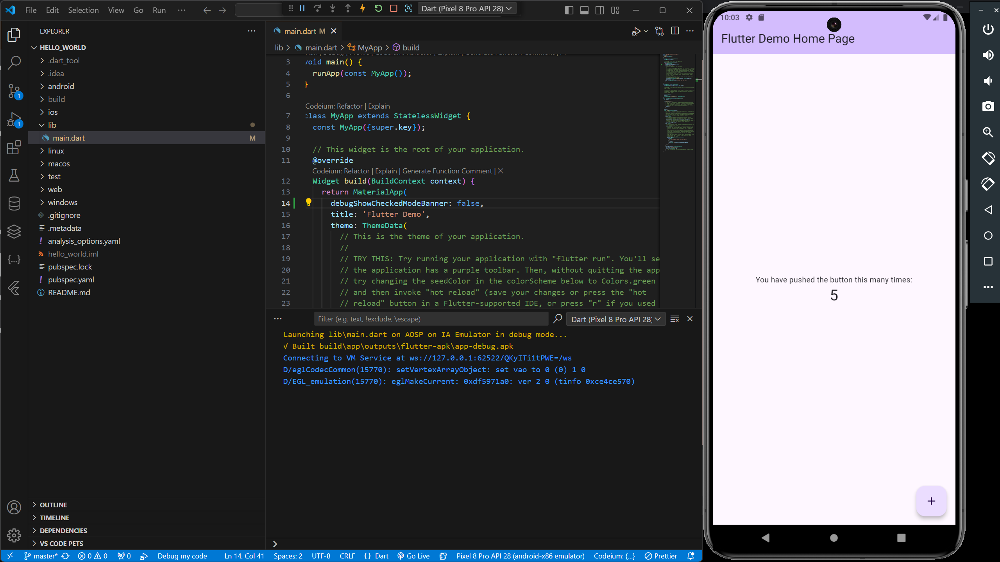
### Praktikum 3 - Membuat Repo dan Laporan
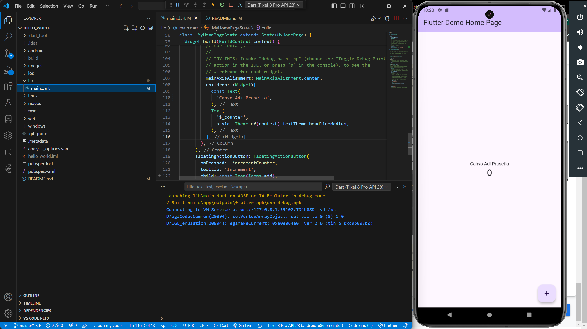
### Praktikum 4 - Menerapkan Widget Dasar
> Text Widget\
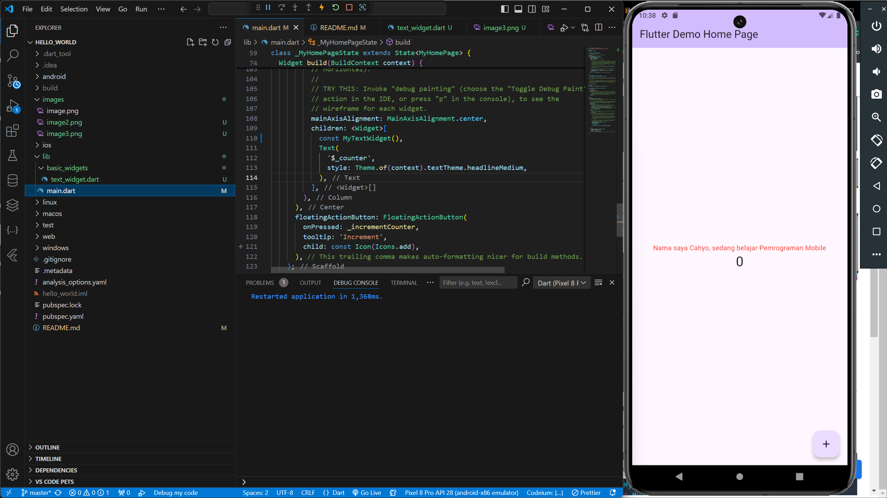

> Image Widget\
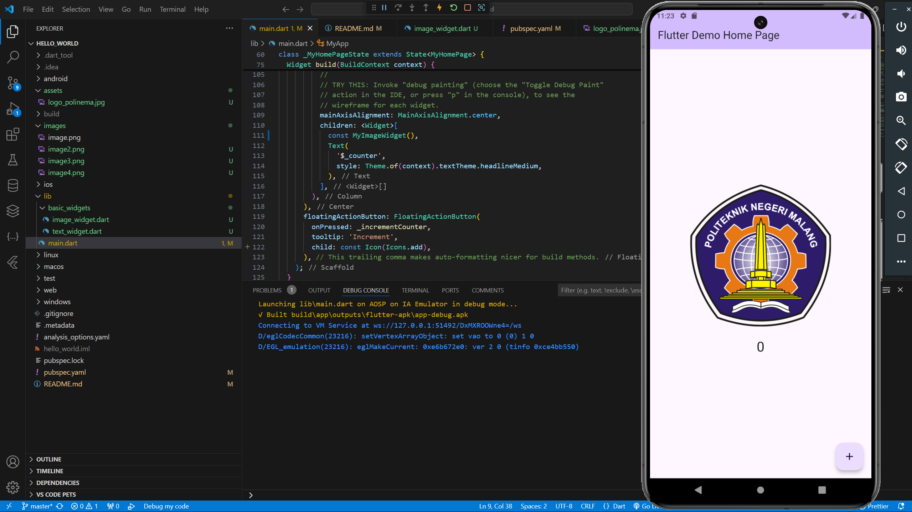

### Praktikum 5 - Menerapkan Widget Material Design dan iOS Cupertino
#### Langkah 1 : Cupertino Button dan Loading Bar
> 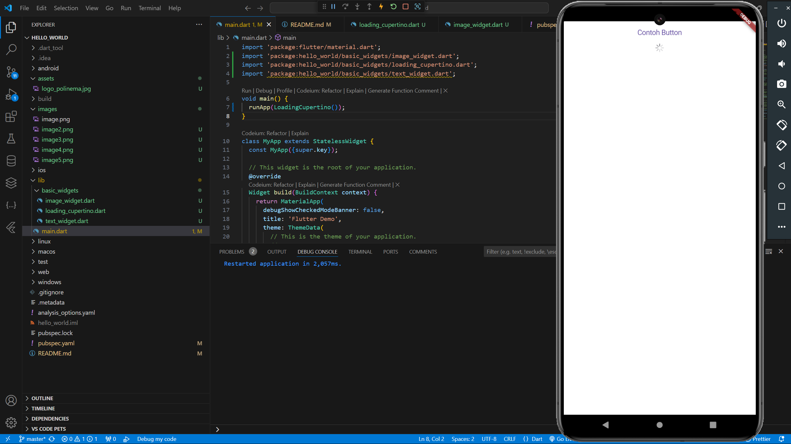
#### Langkah 2 : Floating Action Button (FAB)
>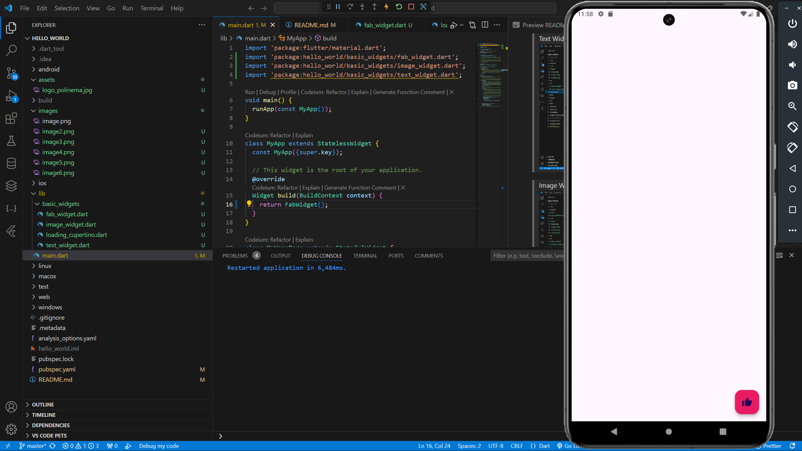
#### Langkah 3 : Scaffold Widget
>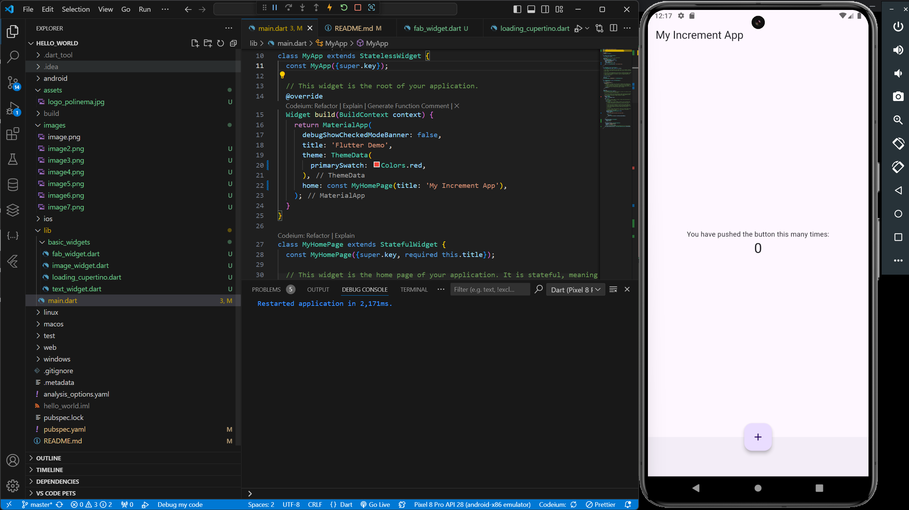
#### Langkah 4 : Dialog Widget
> 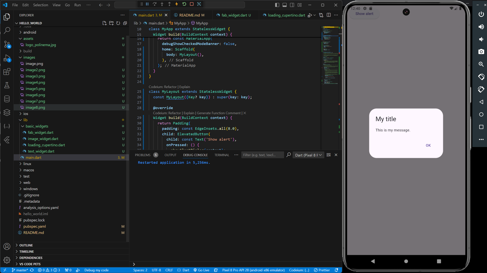
#### Langkah 5 : Input dan Selection Widget
>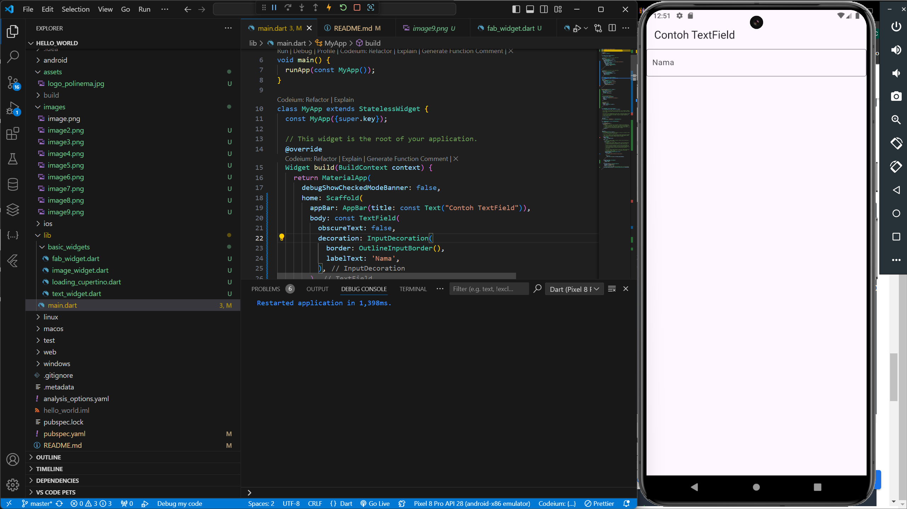
#### Langkah 6 : Date and Time Pickers
>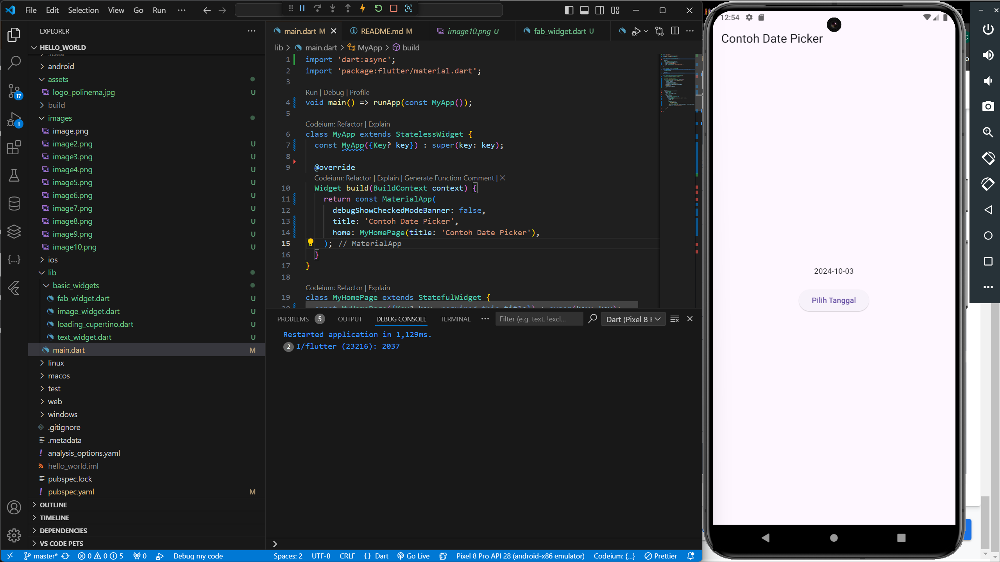